# Sardips

I wanted to make a virtual pet game for web-browsers. But I failed, I got caught up making too many systems to many minigames, Too many sardips (the pets), Too much food with a confusing stomach and taste system.

The long and short of it is too much scope, too little competence.

I strongly think not having a real game for the years on and off working on it dramatically made it less fun to work on. Just separate parts.

Anywhere here it is all that will be completed of this iteration.

## Highlights
### Home Screen

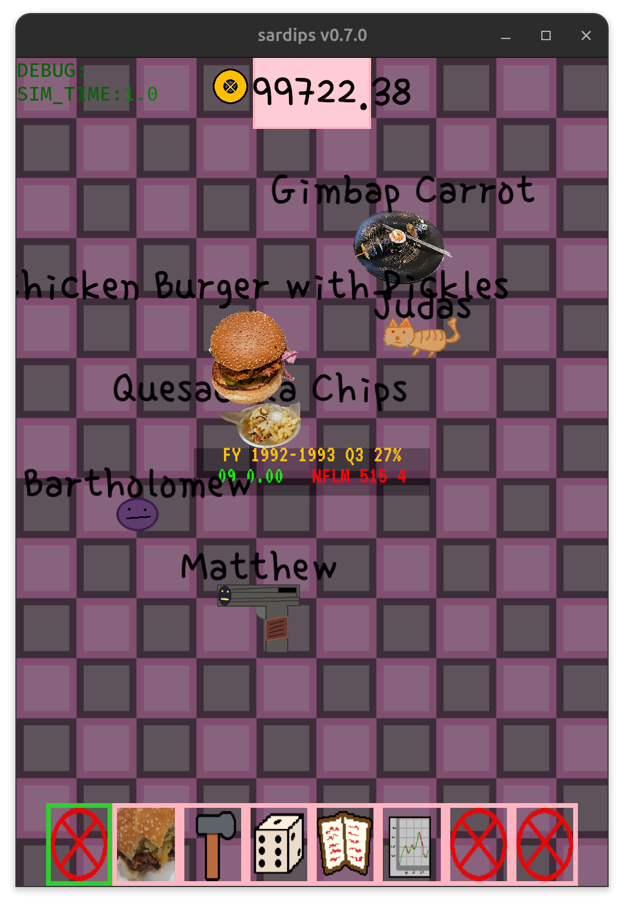

### Buying food
Over 40 foods exist in the game.

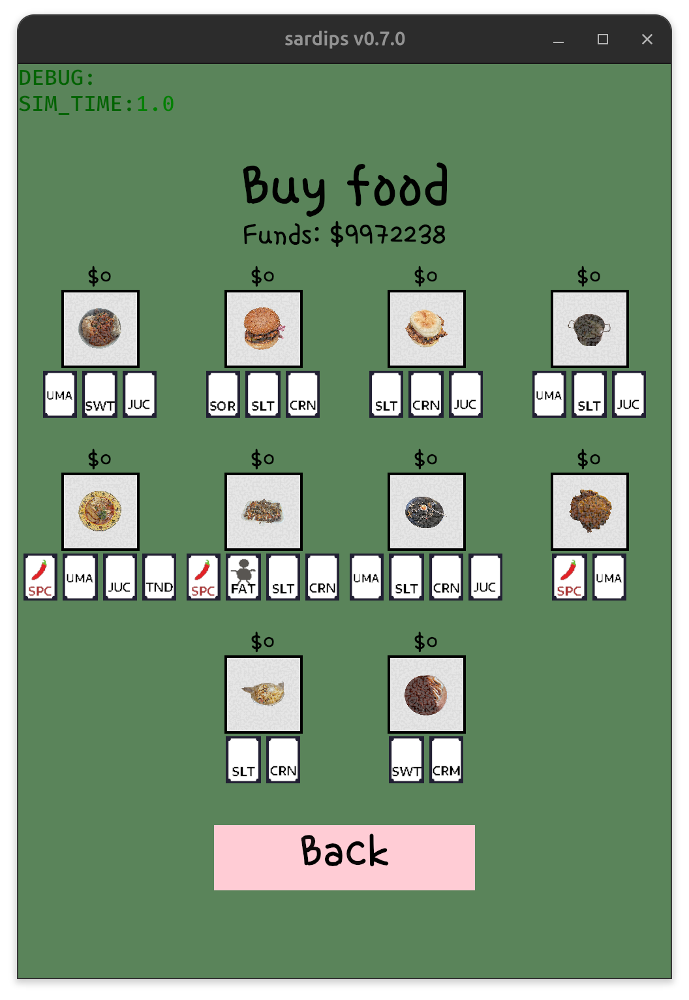

### Stock system
I implemented a full on stock sim which includes ghost buyers p/e, p/b and PEG Ratios.

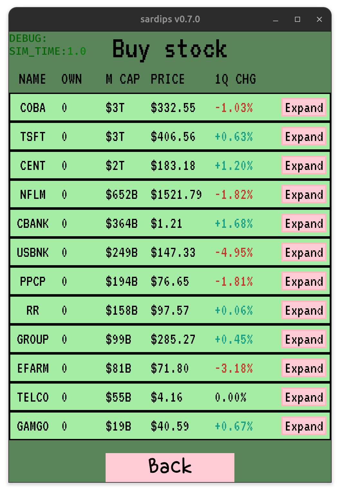
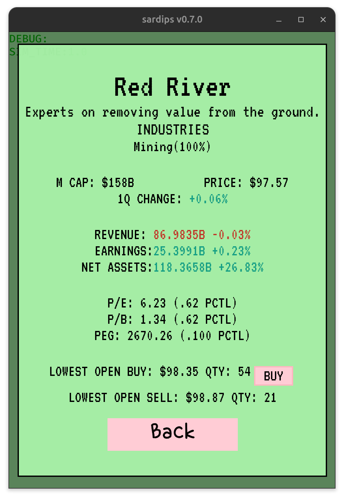
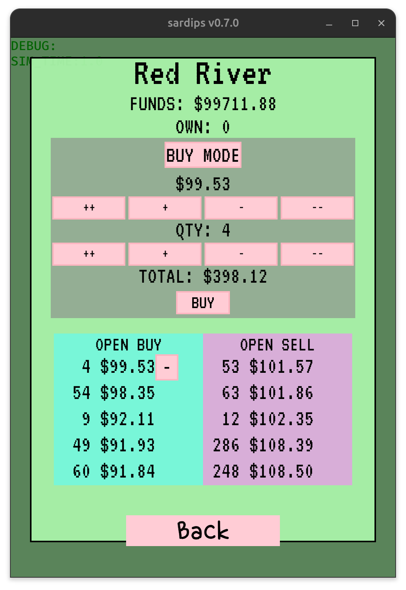

### Mini games
Created a set of minigames which different sardips like or hate more.

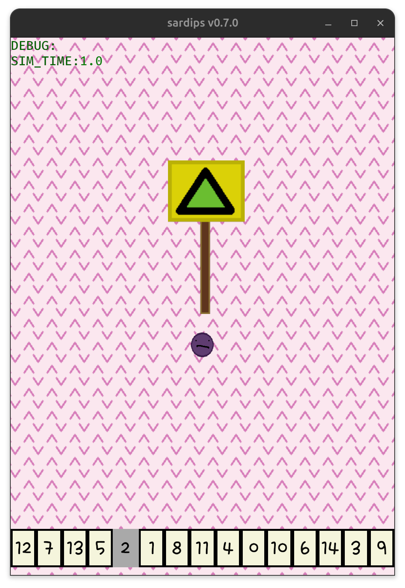
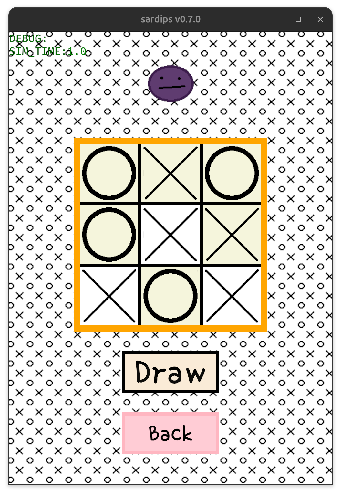
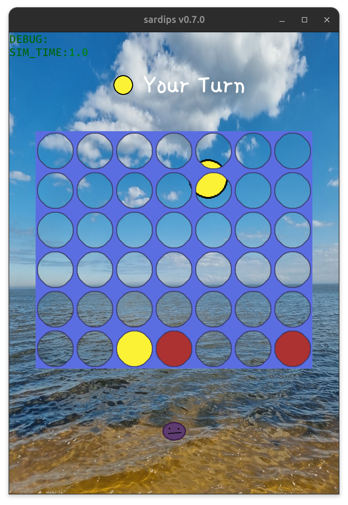
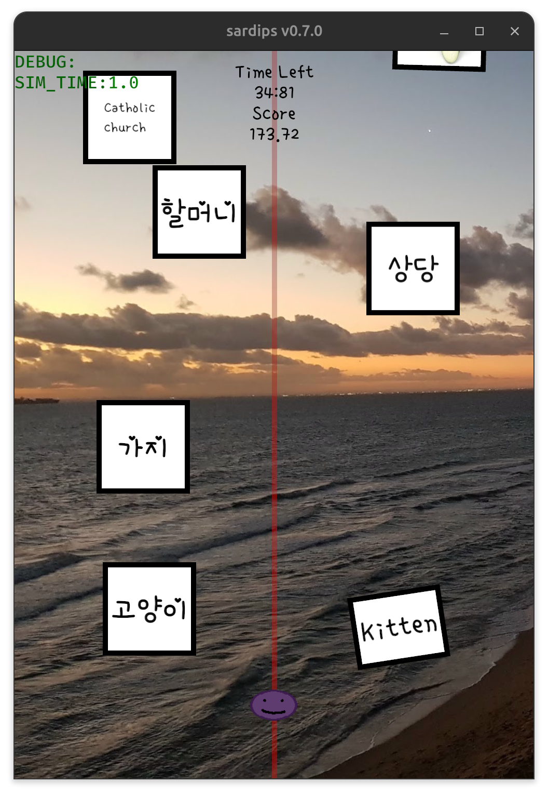
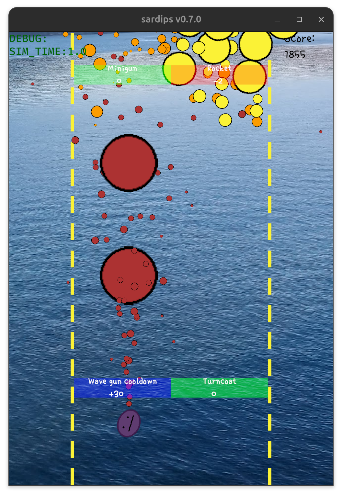
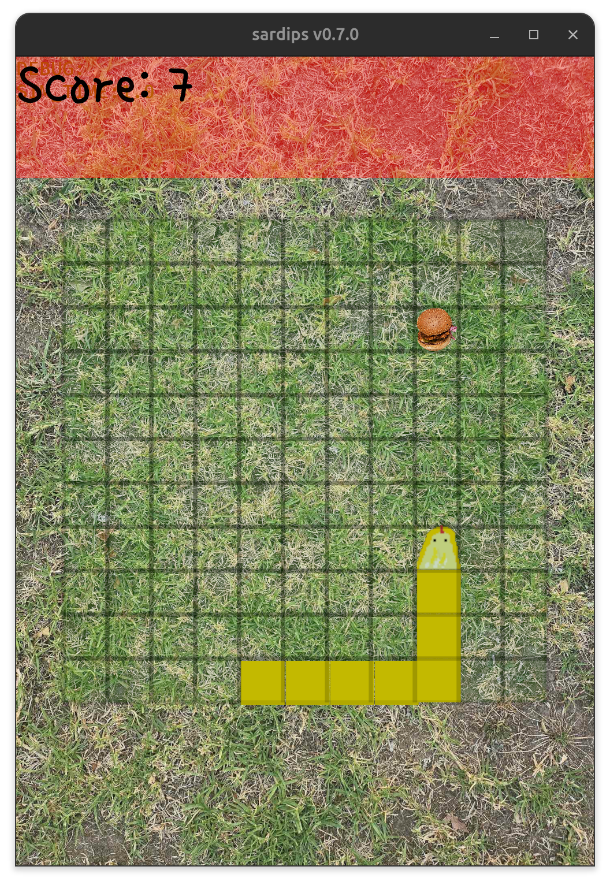

### Lot's of Sardips (Pets)
Created 38 pets all with 5 different states. Different likes, Stomachs, Speeds, etc.

    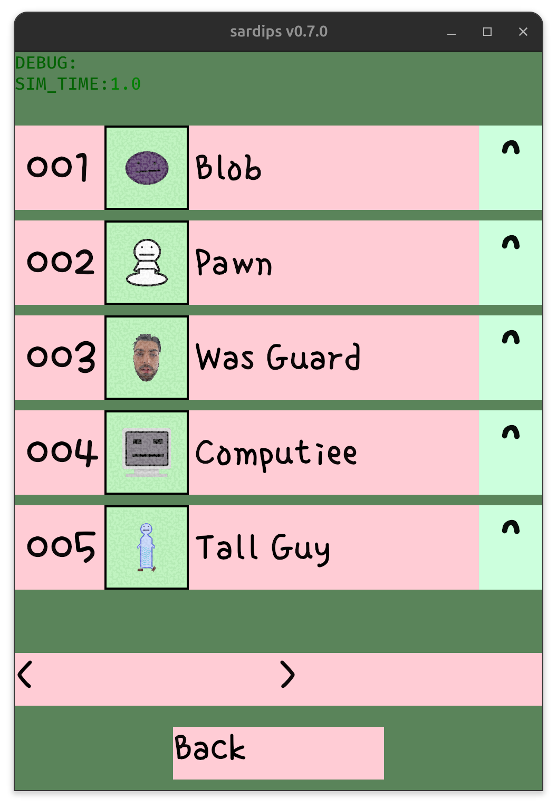
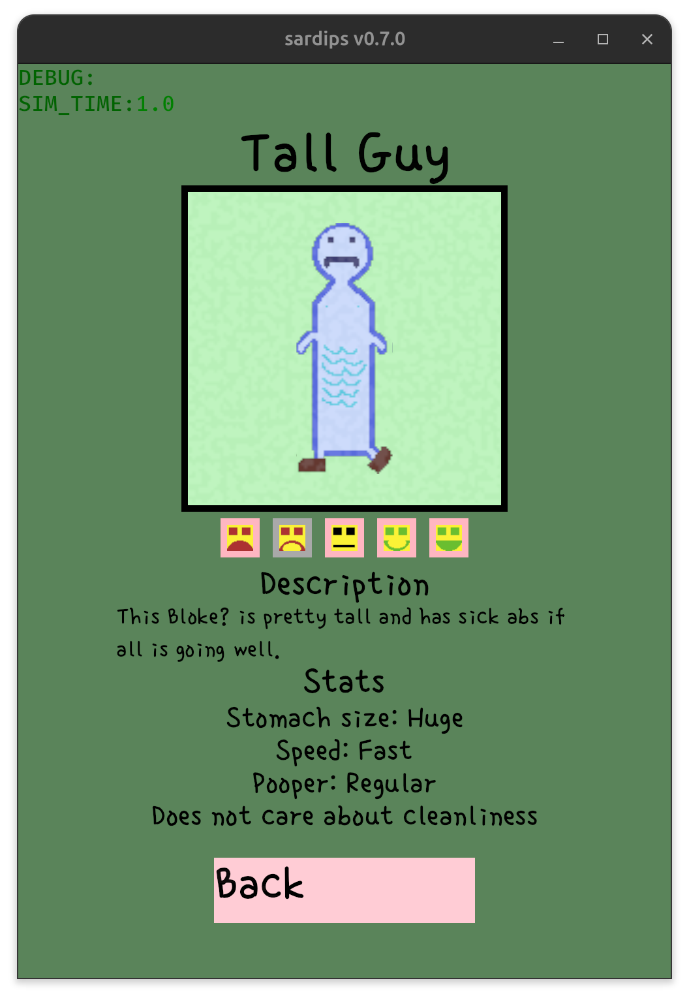
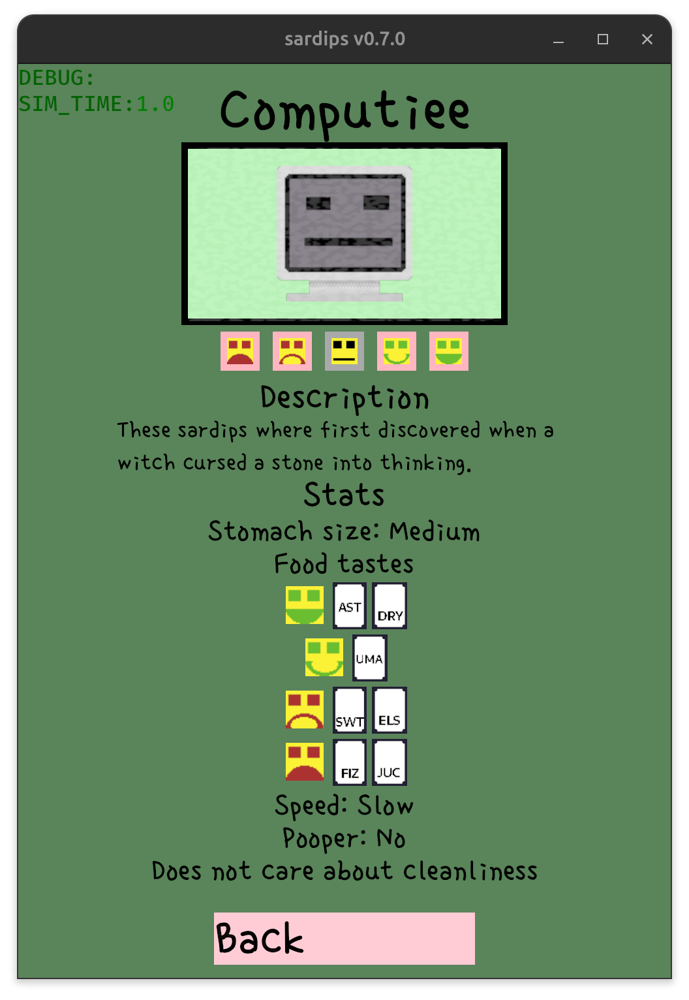

### Full translation system
Only support English and Korean but the whole system is there.

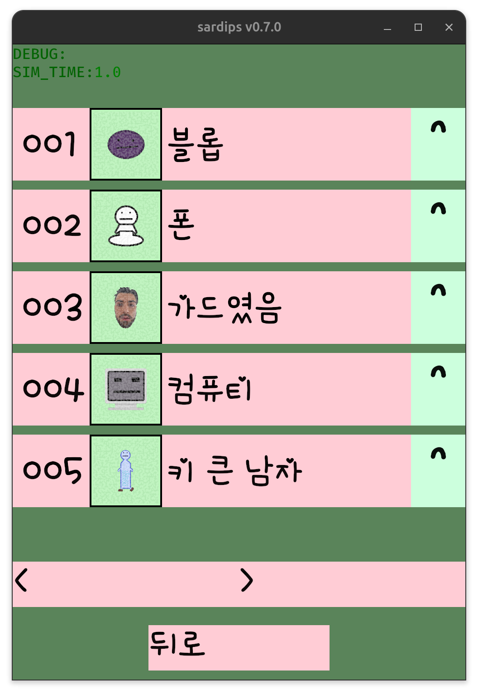

### Accessory + Particle system

## Dev commands
Open the dev console with `/~

set_sim_time_scale (scale): Speed up the sim
spawn_pet (name): Spawn the given pet
evolve_pet (name): Evolve the pet into the given pet
spawn_food (name): Spawn food with the given name
spawn_poop: Spawn poop
clear_all_pets: Kill all pets
clear_all_foods: Kill all food
change_language: Set the language
discover_complete_dipdex: What it says on the tin
spawn_spewer: Spawn a particle spawner
give_money (amount): Give money